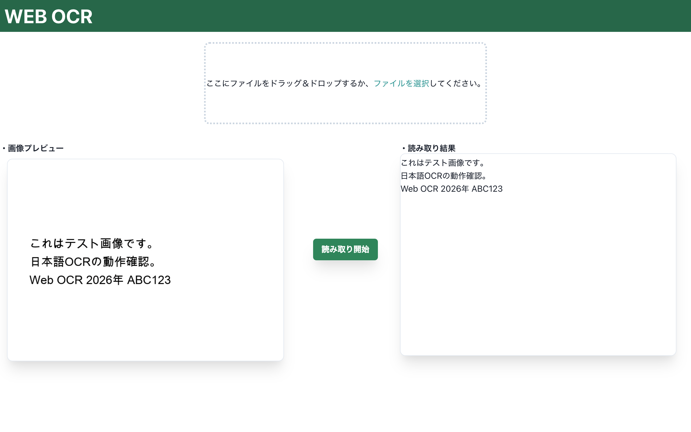
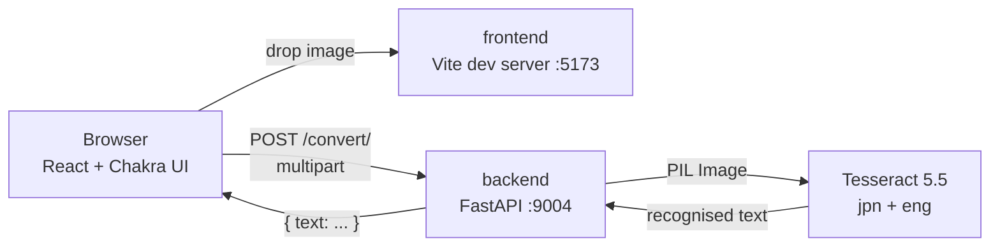

# Web OCR

[日本語](README.md) | English

A web app that extracts Japanese text from images: drop an image in, get editable text back.



## Quick start

```bash
git clone https://github.com/kec4411/web-ocr.git
cd web-ocr && docker compose up
```

Open <http://localhost:5173>. Docker is the only prerequisite — no Node.js, Python, or Tesseract needed on the host.

## Stack

| | |
|---|---|
| Frontend | React 18 / TypeScript / Vite / Chakra UI v2 |
| Backend | Python 3.12 / FastAPI / pytesseract |
| OCR engine | Tesseract 5.5 (LSTM) with Japanese traineddata (incl. vertical) |
| Runtime | Docker Compose |
| Tests | pytest (6) / Vitest + Testing Library (5) |

## Architecture



## Features

- Drag-and-drop or file-picker upload
- Mixed Japanese/English recognition (`jpn+eng`)
- Image preview before upload
- Edit the OCR result in place
- Type and size validation (images only, 10MB cap) with real error messages

## About this repository

This is a three-year-old app rebuilt into something presentable as a portfolio piece. The commit history follows the actual order of the work: import the original code as-is, then modernise it step by step.

When I started, **the app did not work.**

| | Before | Now |
|---|---|---|
| Backend build | **Impossible** (failed in 28s) | Succeeds |
| Japanese OCR | **Never worked** | Works |
| `git clone` | 608MB | **1.0MB** |
| Tracked files | 45,438 | **29** |
| `npm test` | Failed | 11 passing |

## Design decisions

The choices I actually had to reason about, and why.

### 1. I was wrong about what made it slow — until I measured

My hypothesis was that the host's `node_modules` (518MB / 45,340 files) crossing the macOS→Linux VM boundary via bind mount was crippling the frontend. **Measurement disproved it.**

- Warm: 17 seconds
- Cold (174MB webpack cache moved aside): 10 seconds

webpack only reads the modules actually imported, and this app imports few — so the 518MB barely mattered. The frontend was never the bottleneck.

The real cause was the backend, which fails to build in 28 seconds:

```
Cannot find a valid baseurl for repo: base/7/x86_64
failed to solve: process "/bin/sh -c yum update -y" did not complete successfully
```

CentOS 7 hit EOL in June 2024 and its mirrors are gone. The `x86_64` in that path confirms the image was running under QEMU emulation on an arm64 Mac. Three years ago the mirrors were alive, so `yum update` pulled hundreds of packages, OpenCV had no cp36 wheel and fell back to a source build, and **all of it ran under emulation**. That was the "very heavy" part.

So I measured before optimising — and rewrote the justification for every change below when the hypothesis didn't survive contact with the data.

### 2. OpenCV was deleted, not upgraded

`cv2` was used in exactly two calls, both for a jpg→png conversion. **That conversion never needed to exist:**

- Tesseract reads JPEG natively via Leptonica
- PIL reads JPEG natively — and was already imported
- pytesseract serialises the PIL image to its own temp file before shelling out to `tesseract` anyway

So it did double work to produce a format change with no effect on OCR output. Deleting it removed ~220MB (image 667MB → 447MB) and, more importantly, made **six bugs cease to exist rather than get fixed**:

- A TOCTOU race returning a path to a just-deleted file (`create_temppath`)
- A temp-file leak from a `try/finally` with no `except`
- A second `FileNotFoundError` in `finally` masking the real `HTTPException`
- `.JPG`/`.JPEG` (uppercase) silently skipping the conversion branch

**Deleting the code that causes a bug beats fixing the bug.**

### 3. pyocr → pytesseract (not a popularity contest)

Japanese OCR had never worked. Here's why:

```python
langs = tool.get_available_languages()  # ['eng', 'jpn', 'jpn_vert', 'osd']
lang = langs[0]                         # -> 'eng'
```

`get_available_languages()` returns a sorted list, so `langs[0]` is always `'eng'`. The Dockerfile went out of its way to install the Japanese pack and the entire UI is Japanese, yet the backend was hardcoded into English. Measured on the same image:

| | Output |
|---|---|
| Before | `CNETAKHRTS.` / `BARBOCRO BF HER.` / `Web OCR 20264F ABC123` |
| After | `これはテスト画像です。` / `日本語OCRの動作確認。` / `Web OCR 2026年 ABC123` |

I didn't switch because pytesseract is more popular. I switched because **both headline bugs (`langs[0]`, and `tools[0]` raising `IndexError`) are artifacts of pyocr's API shape** — an API that hands you an ordered list and invites you to index it. pytesseract has no language list to index; you pass `lang='jpn+eng'` explicitly. **The bug class stops existing instead of being guarded.**

### 4. A side effect that mattered more than the size win: Tesseract 3.04 → 5.5

CentOS 7's EPEL shipped Tesseract **3.04** — the legacy pattern-matching engine. `python:3.12-slim` gives **5.5**, the LSTM engine. For Japanese that isn't a marginal gain, it's a different quality tier. So the migration didn't just shrink the image; it improved the app's core function.

### 5. Isolating node_modules takes two mechanisms, not one

This was a correctness problem, not a speed one. The old frontend Dockerfile was a two-line stub with no `npm install` — every dependency came from the host bind mount, meaning **macOS-built binaries were executing inside a Linux container.**

Measured after introducing the named volume:

| | Native binary |
|---|---|
| Container | `@rolldown/binding-linux-arm64-musl` |
| Host | `@rolldown/binding-darwin-arm64` |

Two mechanisms are needed, and **missing either one puts the darwin binaries back in the Linux container**:

- `.dockerignore` — stops `COPY . .` baking the host's `node_modules` into the image
- A named volume — stops the bind mount from *shadowing* the image's `/app/node_modules`

### 6. Multi-stage for the frontend only

The asymmetry is deliberate. The test is whether a builder stage has anything real to discard:

- **Frontend**: the prod stage drops `node_modules` and serves static files on nginx. **545MB → 92.4MB.** Real.
- **Backend**: every dependency is pure Python or ships an aarch64 wheel, so **no compiler toolchain is ever installed**. A builder stage would discard nothing — 10 extra lines for 0MB. `--no-cache-dir` plus `rm -rf /var/lib/apt/lists/*` does the job.

Applied where the benefit exists, not as a reflex.

### 7. Chakra UI stays on v2

- v3 is a ground-up rewrite on Ark UI; `ChakraProvider` and the `theme` export both disappear
- **`Editable` — the component this app is built around — has one of the most-changed APIs in v3**, so the migration risk concentrates exactly where the app lives
- Zero portfolio value, against a real risk of the migration consuming the project and leaving the actual bugs unfixed

Bumped `^2.4.9` → `^2.10.10` instead. React is **pinned to 18.3.1** (Chakra v2 has known issues on React 19).

### 8. TypeScript did some of the bug-fixing mechanically

The migration wasn't cosmetic. With `strict` plus **`noUncheckedIndexedAccess`**, the compiler surfaces:

- `acceptedFiles[0]` as `File | undefined` — the exact bug that sent the string `"undefined"` to the backend
- `<Editable value={ocrText}>` with `ocrText: string | undefined` — forcing the missing `onChange` and undefined initial value into view

### 9. Every test exists because its bug actually shipped

No coverage chase — 11 tests, each guarding a real defect. The best value-per-line is `test_japanese_langpack_installed`, which just asserts `{'jpn','eng'} <= set(pytesseract.get_languages())` and directly guards the language bug above.

I verified they work as regression tests: removing `onChange` from `Editable` fails `lets the user edit the OCR result` and **only** that test.

### 10. The git history was rebuilt

**99.94% of tracked files (45,410 of 45,438) were `node_modules`.** The largest blobs weren't even dependencies — they were webpack's dev cache (65.8MB and 36.5MB `.pack` files). All non-`node_modules` content in the entire history came to **1.35MB**.

`git-filter-repo` exists to preserve a real history while excising paths from it. Here the history was one commit called "initial commit" with nothing worth preserving, so `rm -rf .git && git init` was the honest tool. I committed the original code first, then stacked the modernisation on top — matching the actual order of the work, so the commit log reads as a record of it.

Result: `.git` 88MB → **720KB**; `git clone` 608MB → **1.0MB**.

## Development

```bash
# Start
#   First build: ≈27s (with base images already pulled; add pull time if not)
#   Afterwards:  ≈7s
docker compose up

# Backend tests
docker compose exec backend pip install -r requirements-dev.txt
docker compose exec backend python -m pytest

# Frontend tests and typecheck
cd frontend
npm install
npm test
npm run typecheck

# Production build (nginx, http://localhost:8080)
docker compose --profile prod up frontend-prod
```

### Environment variables

| Variable | Default | Purpose |
|---|---|---|
| `OCR_LANG` | `jpn+eng` | Tesseract languages. Japanese documents routinely embed Latin text, hence the pair |
| `OCR_PSM` | `3` | Page segmentation mode. 3 = automatic (Tesseract's own default) |
| `MAX_UPLOAD_BYTES` | `10485760` | Upload cap (10MB) |
| `CORS_ALLOW_ORIGINS` | `http://localhost:5173` | Allowed origins, comma-separated |
| `VITE_API_BASE_URL` | `http://localhost:9004` | Where the frontend looks for the API |

> **Note:** Vite inlines `VITE_*` at **build** time. Compose's `environment:` works for the dev server, but the **production image needs it as a build arg** (see `ARG VITE_API_BASE_URL` in `frontend/Dockerfile`) — a runtime env var never reaches the bundle.

## Troubleshooting

### Changed `package.json` but the new dependency isn't there

`node_modules` lives in a named volume. The volume is populated from the image on first creation and then persists, so a stale volume keeps shadowing the rebuilt image.

```bash
docker compose down -v && docker compose up --build
```

### Changed `OCR_LANG` and the container won't start

That's intentional. A startup check verifies the language packs and crashes the container **at boot** rather than on a user's first upload:

```
RuntimeError: Tesseract 5.5.0 is missing language pack(s): ['klingon'].
Installed: ['eng', 'jpn', 'jpn_vert', 'osd']
```

Add the pack to `apt-get install` in `backend/Dockerfile`.

## Known limitations

- Accuracy depends on input quality; there is no preprocessing (deskew, binarisation)
- No PDF support — images only
- Results aren't persisted; leaving the page loses them
- No authentication. This is a local development setup

## License

MIT
