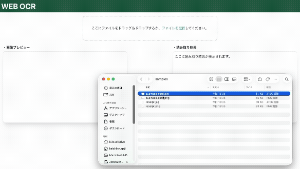
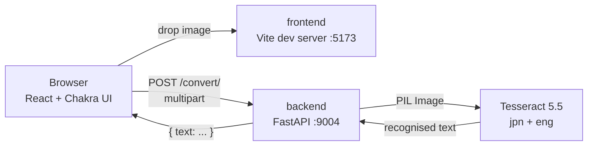

# Web OCR

[日本語](README.md) | English

A web app that extracts Japanese text from images: drop an image in, get editable text back.



## Quick start

```bash
git clone https://github.com/kec4411/web-ocr.git
cd web-ocr && docker compose up
```

Open <http://localhost:5173>. Docker is the only prerequisite — no Node.js, Python, or Tesseract needed on the host.

Sample images are included in [`docs/samples/`](docs/samples) — a business card and a receipt, both fictional.

## Stack

| | |
|---|---|
| Frontend | React 18 / TypeScript / Vite / Chakra UI v2 |
| Backend | Python 3.12 / FastAPI / pytesseract |
| OCR engine | Tesseract 5.5 (LSTM) with Japanese traineddata (incl. vertical) |
| Runtime | Docker Compose |
| Tests | pytest (7) / Vitest + Testing Library (5) |

## Architecture



## Features

- Drag-and-drop or file-picker upload
- Mixed Japanese/English recognition (`jpn+eng`)
- Image preview before upload
- Edit the OCR result in place; the field grows to fit the number of lines
- Type and size validation (images only, 10MB cap) with real error messages

## About this repository

This is a three-year-old app rebuilt into something presentable as a portfolio piece. The commit history follows the actual order of the work: import the original code as-is, then modernise it step by step.

When I started, **the app did not work.**

| | Before | Now |
|---|---|---|
| Backend build | **Impossible** (failed in 28s) | Succeeds |
| Japanese OCR | **Never worked** | Works |
| `git clone` | 608MB | **1.5MB** |
| Tracked files | 45,438 | **32** |
| Tests | `npm test` failed; backend had none | 7 pytest / 5 Vitest |

> The individual technical decisions and their rationale are collected in the [design notes](docs/design-notes.en.md).

## Development

```bash
# Start
#   First build: ≈27s (with base images already pulled; add pull time if not)
#   Afterwards:  ≈7s
docker compose up

# Backend tests
docker compose exec backend pip install -r requirements-dev.txt
docker compose exec backend python -m pytest

# Frontend tests and typecheck
cd frontend
npm install
npm test
npm run typecheck

# Production build (nginx, http://localhost:8080)
docker compose --profile prod up frontend-prod
```

### Environment variables

| Variable | Default | Purpose |
|---|---|---|
| `OCR_LANG` | `jpn+eng` | Tesseract languages. Japanese documents routinely embed Latin text, hence the pair |
| `OCR_PSM` | `3` | Page segmentation mode. 3 = automatic (Tesseract's own default) |
| `MAX_UPLOAD_BYTES` | `10485760` | Upload cap (10MB) |
| `CORS_ALLOW_ORIGINS` | `http://localhost:5173,http://localhost:8080` | Allowed origins, comma-separated. 5173 = Vite, 8080 = nginx (prod) |
| `VITE_API_BASE_URL` | `http://localhost:9004` | Where the frontend looks for the API |

> **Note:** Vite inlines `VITE_*` at **build** time. Compose's `environment:` works for the dev server, but the **production image needs it as a build arg** (see `ARG VITE_API_BASE_URL` in `frontend/Dockerfile`) — a runtime env var never reaches the bundle.

## Troubleshooting

### Changed `package.json` but the new dependency isn't there

`node_modules` lives in a named volume. The volume is populated from the image on first creation and then persists, so a stale volume keeps shadowing the rebuilt image.

```bash
docker compose down -v && docker compose up --build
```

### Changed `OCR_LANG` and the container won't start

That's intentional. A startup check verifies the language packs and crashes the container **at boot** rather than on a user's first upload:

```
RuntimeError: Tesseract 5.5.0 is missing language pack(s): ['klingon'].
Installed: ['eng', 'jpn', 'jpn_vert', 'osd']
```

Add the pack to `apt-get install` in `backend/Dockerfile`.

## Known limitations

- Accuracy depends on input quality; there is no preprocessing (deskew, binarisation)
- No PDF support — images only
- Results aren't persisted; leaving the page loses them
- No authentication. This is a local development setup

## License

MIT
