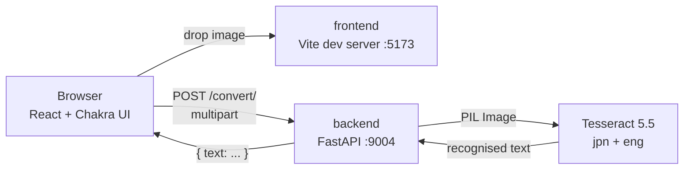

# Web OCR

[日本語](README.md) | English

A web app that extracts Japanese text from images: drop an image in, get editable text back.


## Quick start

```bash
git clone https://github.com/kec4411/web-ocr.git
cd web-ocr && docker compose up
```

Open <http://localhost:5173>. Docker is the only prerequisite — no Node.js, Python, or Tesseract needed on the host.

Sample images are included in [`docs/samples/`](docs/samples) — a business card and a receipt, both fictional.

## Stack

| | |
|---|---|
| Frontend | React 18 / TypeScript / Vite / Chakra UI v2 |
| Backend | Python 3.12 / FastAPI / pytesseract |
| OCR engine | Tesseract 5.5 (LSTM) with Japanese traineddata (incl. vertical) |
| Runtime | Docker Compose |
| Tests | pytest (7) / Vitest + Testing Library (5) |

## Architecture



## Features

- Drag-and-drop or file-picker upload
- Mixed Japanese/English recognition (`jpn+eng`)
- Image preview before upload
- Edit the OCR result in place; the field grows to fit the number of lines
- Type and size validation (images only, 10MB cap) with real error messages

## About this repository

This is a three-year-old app rebuilt into something presentable as a portfolio piece. The commit history follows the actual order of the work: import the original code as-is, then modernise it step by step.

When I started, **the app did not work.**

| | Before | Now |
|---|---|---|
| Backend build | **Impossible** (failed in 28s) | Succeeds |
| Japanese OCR | **Not working** | Works |
| `git clone` | 608MB | **1.5MB** |
| Tracked files | 45,438 | **32** |
| Tests | `npm test` failed; backend had none | 7 pytest / 5 Vitest |

> Development, environment variables, troubleshooting, and the design rationale live in the [design & development notes](docs/design-notes.en.md).

## Known limitations

- Accuracy depends on input quality; there is no preprocessing (deskew, binarisation)
- No PDF support — images only
- Results aren't persisted; leaving the page loses them
- No authentication. This is a local development setup
