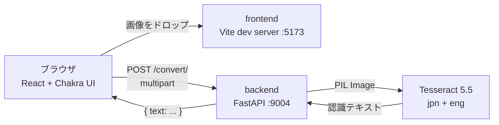

# Web OCR

日本語 | [English](README.en.md)

画像をドラッグ＆ドロップするだけで、日本語の文字起こしができる Web アプリケーションです。読み取った結果はその場で編集できます。


## クイックスタート

```bash
git clone https://github.com/kec4411/web-ocr.git
cd web-ocr && docker compose up
```

ブラウザで <http://localhost:5173> を開いてください。必要なものは Docker だけです。Node.js も Python も Tesseract もホストには不要です。

動作確認用のサンプル画像を [`docs/samples/`](docs/samples) に同梱しています（名刺・レシート、いずれも架空データ）。

## 技術スタック

| | |
|---|---|
| フロントエンド | React 18 / TypeScript / Vite / Chakra UI v2 |
| バックエンド | Python 3.12 / FastAPI / pytesseract |
| OCR エンジン | Tesseract 5.5 (LSTM) + 日本語学習データ (縦書き対応) |
| 実行環境 | Docker Compose |
| テスト | pytest (7件) / Vitest + Testing Library (5件) |

## アーキテクチャ



## 機能

- 画像のドラッグ＆ドロップ、またはファイル選択によるアップロード
- 日本語と英語の混在テキストの認識（`jpn+eng`）
- アップロード前のプレビュー表示
- 読み取り結果はその場で編集でき、行数に応じてテキストエリアが自動で広がる
- 形式・サイズの検証（画像のみ、10MB まで）とエラーの明示

## このリポジトリについて

3年前に開発したアプリケーションを、ポートフォリオとして提出できる状態に再構築したものです。コミット履歴は「当時のコードをそのまま取り込む」→「段階的に現代化する」という実際の作業順に並んでいます。

着手時点で、**このアプリは動作しませんでした。**

| | 着手前 | 現在 |
|---|---|---|
| バックエンドのビルド | **不可能**（28秒で失敗） | 成功 |
| 日本語 OCR | **動いていなかった** | 動作 |
| `git clone` | 608MB | **1.5MB** |
| 追跡ファイル数 | 45,438 | **32** |
| テスト | `npm test` が失敗、バックエンドは0件 | pytest 7件 / Vitest 5件 |

> 開発手順・環境変数・トラブルシューティング・設計判断は [設計・開発メモ](docs/design-notes.md) にまとめています。

## 既知の制約

- OCR 精度は入力画像の品質に依存します。傾き補正や二値化などの前処理は行っていません
- PDF は非対応（画像のみ）
- 読み取り結果の保存機能はありません。ページを離れると結果は失われます
- 認証はありません。ローカル開発用の構成です

## ライセンス

MIT
